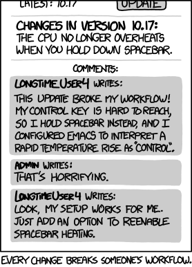

Up until now, I've worked on projects that require one programmer. I've had mentors for guidance and partners in other disciplines, but never someone else to really check my work. There are field of studies that revolve on communication/management- I understand that this is a really deep subject. What I plan to take away from this class are better communication skills and knowledge of how to develop/manage large codebases with multiple users. 

The hardest task in every technical project I have is explaining the project itself in a non-technical manner. I remember a conversation I had with a professor about my Vojale project: 

> "So what is your project?"
> "Given a set of XY coordinates converted from celestial coordinates in the Yale Bright Star Catalog..."
> "Now explain this as if I were your mom." 

Working on a group means that I will have to learn to summarize for different audiences. Hopefully the group project we perform will help me practice and hone this skill.

I also understand that larger scale projects require special tools and procedures. Version control such as Git and SVN help everyone who uses the codebase to have the same code. Integrated development enviroments increase productivity with features such as predictive typing and function reference. Coding guidelines help code not written by you to look readable. I am familiar with these portions of software engineering, and would love to learn more tools and practices involved in this area.

Image found [here](https://i2.wp.com/s3.amazonaws.com/production-wordpress-assets/blog/wp-content/uploads/2013/03/workflow-1.png?resize=278%2C386&ssl=1).
