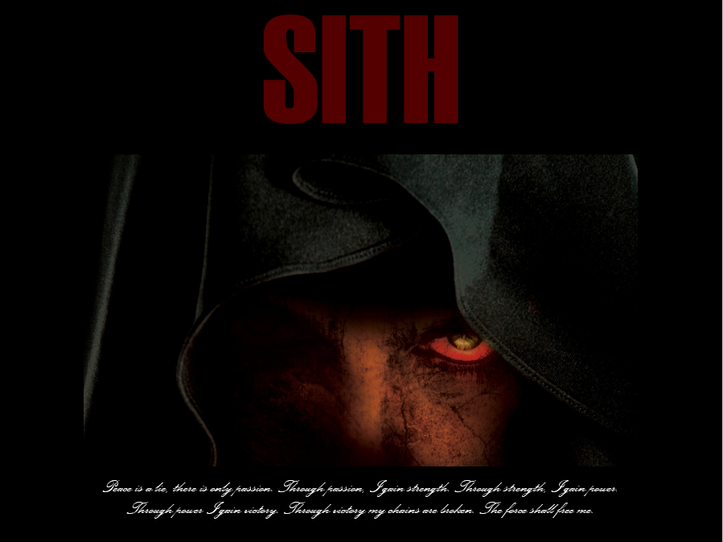

## Game Overview

Eyes of Sith is a text based adventure game written in Common Lisp where the player can roam Korriban as an 'Old Republic Era' Sith and play as evil or friendly as their heart desires. Your master, Darth Imperius, has tasked you with killing Darth Nox. You must collect the right items to defeat him, or perish trying. 

If you have ever played a Bioware game, then think of this as a watered down version of that. You interact with characters (referred to as NPCs here) in the game and choose decisions based on this. Every decision you make changes your current story. Here's an excerpt from interacting with Darth Imperius.

```
look

--------------------------------------------------------------------------
You see an empty row of decorated thrones. All of the lords are currently
in a meeting.
--------------------------------------------------------------------------
You are now in the Dark Councils Chambers on Korriban. There is a door going
 right from here. There is a stairway going downstairs from here.
 Darth Imperius is nearby.
 
select darth-imperius

Darth Imperius is now the selected NPC.

talk

Have you killed him yet?
--------------------------------------------------------------------------
(A): Yes, I have killed him.
(B): I did not kill him yet.
--------------------------------------------------------------------------

b
--------------------------------------------------------------------------
Then you know what to do. Do not return to me until your task is done.
--------------------------------------------------------------------------
```

## Reflection

This game was developed for a project in my programming language theory class. As soon as I saw the assignment, I knew what I wanted to do- make a decision based Star Wars game in the eyes of the villain. I **love** Star Wars, and figured that other people wouldn't turn down to opportunity to shoot lightning from their fingers!

We had several previous assignments that laid the foundation for the project, but making the leap from this template to a game I'd actually want to play was quite the feat. I remember thinking, "Pfff, it shouldn't be too hard change all of this stuff to Star Wars." Boy was I wrong.

The biggest challenge was trying to come up with content: who are the NPCs? what do they do? what if you forget to do X?... Somewhere in my notes, there are five to six pages of the world graph and player decision trees. In addition to this, we had to put this into one of the most confusing languages I've had to deal with: Lisp. If I made an error in trying to format the NPC's dialogue, I would have to manually change each entry. 

After hours and hours of ever-so-slight tweaks, I was proud with what I made: my first game in Lisp. Sure there are better languages for the job, but I have learned to think in a significantly different manner. I know that having these different types of approaches will further my Computer Science path.

I have a GitHub repository [here](https://github.com/glennga/eyes-of-sith) if you want to know more.


