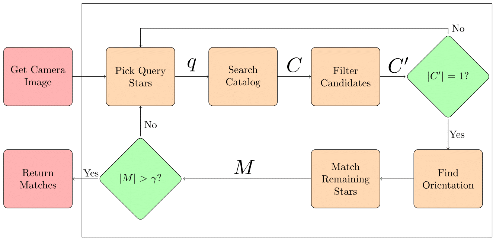

## Summary 

This research involves the empirical analysis of various lost-in-space star identification techniques, as well a technique I proposed myself. This project is still in progress, and I am looking to write a paper on it soon. As of now, it appears that the simplest method (the Angle method) is the most efficient way to identify stars while being lost in space.

This project was funded by Undergraduate Research Opportunities Program, and I am under the direction of Dr. Lipyeow Lim. 

## Background 

Let us define some terms: 

1. *Star identification* here, refers to a computational approach to cross referencing the stars are in the sky with those in some knowledge base.
2. *Lost-in-space* refers to an additional constraint on the problem: the absence of knowing where we took the picture and how we pointed the camera. 

The problem of star identification has roots in early navigation. Ancient mariners could look up at the night sky, point out which stars they were looking at, and navigate across the globe with precision. There was no Google Maps or Siri telling them where to go- instead they used the ocean swells, the wildlife around them, and the stars. Stars alone provide a wealth of positional information that can be accessed by simply looking outside.

Of course we do have Google Maps and Siri, so why is this a problem? The answer is **spacecraft orientation**. In space, there is no *up* or *down*, it's all relative. On Earth when we say up or down, we mean "up from Earth", or "down toward Earth". In space, we need to be able to say something similar but with stellar objects that are not the Earth. The approach this project refers to, is to use stars as these objects. 

We want to optimize this approach to ensure mission success. The few seconds spent trying to determine your attitude (or facing the wrong direction entirely) could be difference between mission success and mission failure. 

## Methods 

To study this process, I analyzed four existing techniques: Tappe’s Angle Method, Cole & Crassidus’s Planar Triangles Method, Cole & Crassidus’s Spherical Triangles Method, and Mortari’s Pyramid Method. Early tests favored the Planar Triangle Method and the Pyramid Method, so I analyzed the results of combining the two as well. I denote this as the CoIn Method.

Many of these methods follow a basic process,which is defined below:

## Experiments

For the first experiment, I characterized the ‘Search Catalog’ step of each method. I checked if our candidates *C* contained the correct label for our query stars *q* under the presence of centroiding error (tiny shifts in the position of the stars). My results show that using planar triangles (i.e. the Planar Triangle and CoIn methods) is the most noise tolerant technique to search the catalog with.

My next experiment involved characterizing the ‘Find Orientation’ step of each method.Here I examined the accuracy of the resulting catalog-image star pairing, assuming *C'* is correct under the presence of centroiding error. My results here show that orientation determination of the Pyramid /CoIn method is the most tolerant technique. 

The third experiment I performed was characterizing a *single* start of each method to the *|C'| = 1* decision. This combines the two filtering steps to find *C' and *C*, and would allow us to see if negative performance in the ‘Search Catalog’ impacts our‘Filter Candidates’ step. The experiment is setup to measure if our query stars *q* contain (not match) the same labels as *C'*, and is still being performed. Preliminary results suggest that negative performance in the ‘Search Catalog’ does not impact our performance in the next step.

The last experiment I performed was to characterize the “end to end” efficiency and accuracy of each method. End to end is in quotes here, because a good portion of the literature do not specify steps past the ‘Find Orientation’ step. This again combines the first three experiments, but is run for *until we reach the Find Orientation step*. The experiment is setup to measure if our query stars *q* match (not contain, like the 3rd experiment) the same labels as , and is still being performed as well. Preliminary results show that the Angle method performs the best, and that combining Planar Triangles and the Pyramid method does not yield a better performance. 

The current takeaway from this project is that simpler is better, and that the Angle method is the most efficient star identification method. A more definitive answer is still being considered.

## Comments and Reflection

In the summer of 2016, I had the opportunity to volunteer at the Hawaii Space Flight Laboratory (HSFL). I was under the supervision of HSFL engineers Eric Pilger and Miguel Nunes to develop software for a first-generation star tracker. This project has also been the subject of my ICS499 project.

Switching perspectives from engineering to research really opened my eyes and has helped me lay down a foundation. One road bump I'll share was trying to map a sphere onto a plane for the generated image- it took a good month and a half between talks with Dr. Lim and hours of cartography research to just say, "Let's skip this step." But wait, how can you pick stars from an image if you don't even have an image? The answer was that our goals were different than my time at HSFL. My goal isn't to create a working star tracker, it's to analyze the underlying processes!  The lesson I took from this was to '`ctrl -`' (zoom out) every now and then and perform my sanity checks.

A personal accomplishment of mine was experiment design. What to measure, what to control, how to measure it, … these are pieces of experiments that were laid out in my science labs, and something I never thought about until starting this project. Couple this with the difficulty of putting this design into code, and it gets difficult fast. I am still running experiments for this project, but being able to say I accomplished something like this is quite the reward.

You can track my current progress at my GitHub repository [here](https://github.com/glennga/hoku).