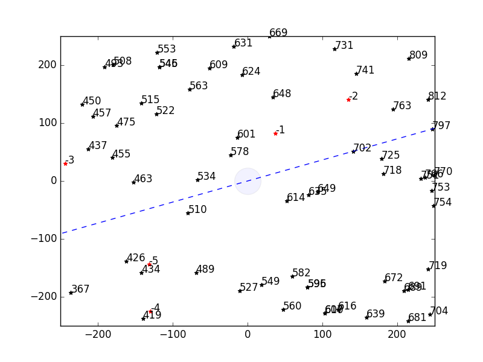

Given an image of the sky without a point of reference (i.e. accelerometer or magnetometer input), is it possible to accurately and efficiently identify the stars in this image? The research here is an attempt to solve this problem, and is an extension of my previous Hawaii Space Flight Laboratory star tracker project. 

The application of this problem lies with estimating attitude for spacecraft. If the stars in an image are known, then an attitude can be derived from an inertial frame. Now knowing which direction the craft is pointing, sensors, solar panels, and propulsion devices can be adjusted appropriately. 

The general strategy behind identifying these stars is to use their position relative to each other. A 2-vertex algorithm will match segments between stars in the input image to segments formed between stars in nature. A 3-vertex algorithm will match specific triangles, and 4-vertex/5-vertex will match quadrilaterals and pentagons respectively. 

I have currently done work toward star density analysis, created a hardware-abstract input, and developed an algorithm + Python implementation for 2-vertex based star matching. I still plan on developing 3-4-5 vertex based star matching, and testing all of these algorithms under the introduction of incorrect data.  

You can learn more at the GitHub repository [here](https://github.com/glennga/vojale).
