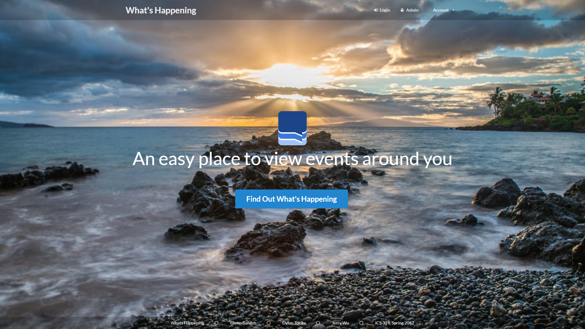

## What is _What's Happening_?

There isn’t a consolidated place where all events on campus can be posted and viewed easily. Event postings are scattered across different media. As a result, promoters have to work hard to get the word out, and consumers have to work hard to search for these events. The **What's Happening** solution is an application where students can both post and view events that are scheduled or happening on campus. You can visit the website live [here](http://whats-happening-uhm.meteorapp.com/)! 

This application was a project for my Software Engineering class, where me and two other students were tasked to create a web application that solves a problem specific to the University of Hawaii community. My peers and I chose the problem of spreading the word of events, or simply the problem of *what's happening*. 

## The Application

Our solution is implemented using a web framework known as Meteor, with the [meteor application template](https://ics-software-engineering.github.io/meteor-application-template) serving as our base. Semantic UI was used as our CSS framework, and we used GitHub issues to manage our development.

Our goal was to provide the functionality below:

- Create and Setup a Profile
- Browse Events
- Save Events
- Attend Events
- Create an Event
- Edit Owned Events
- Edit Their Profile

## Reflection

The main goal of this project was to exercise everything we learned in the course:

1. Javascript, Underscore
2. HTML, Semantic UI
3. Git, Issue Driven Development 
4. Meteor, Mongo, and Galaxy
5. Keeping a Cool Head 

I think it's safe to say that I am confident in all of these topics as of late. Might be a little iffy on #5 though.

In my honest opinion, this was a fairly stressful project. You never know what you have until you lose it, and group work removes a lot of the freedom independent work has. The biggest constraint I had to deal with in my team were our working hours. I preferred to work three hours earlier than they would, and this often resulted in miscommunication. Things like coding practices and work pace are primarily out of a peer's hands, as they have their own tasks to work on. This would in turn, lead to stress about another person's tasks.

That's not to say I didn't enjoy the project though. I really enjoyed producing this amazing application that I can tell my friends and future employers about. I witnessed first-hand just how powerful GitHub issues are. I've gained a deeper understanding of everything I learned in this course. This is definitely an experience I wouldn't trade for any other.  

Our team GitHub page can be found [here](https://whats-happening-uhm.github.io/). The repository for the project can be found [here](https://github.com/whats-happening-uhm/whats-happening-uhm).