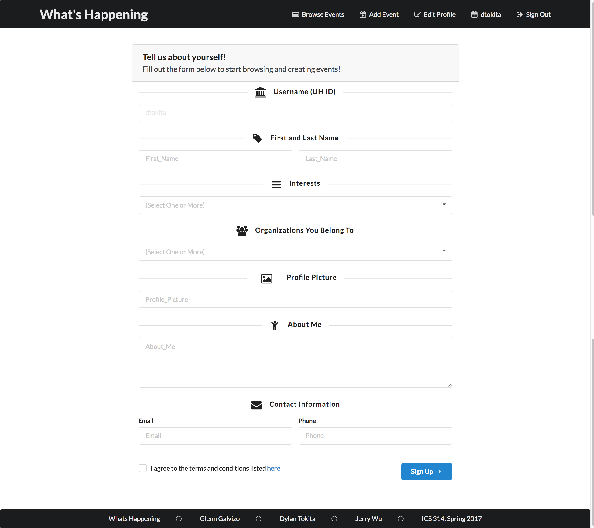
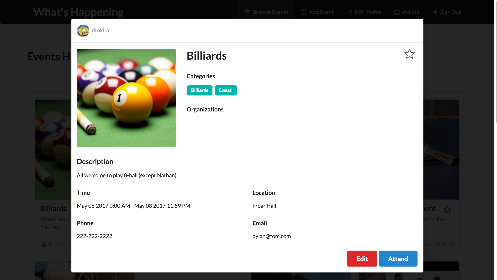
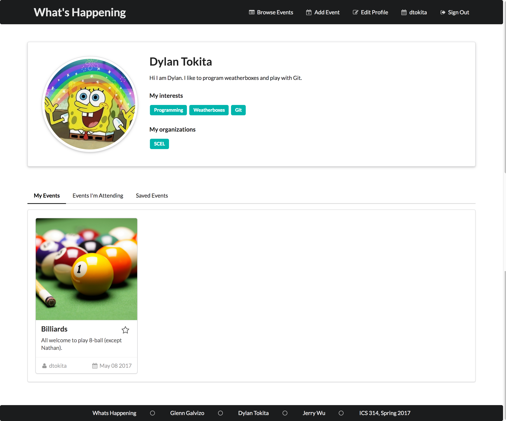
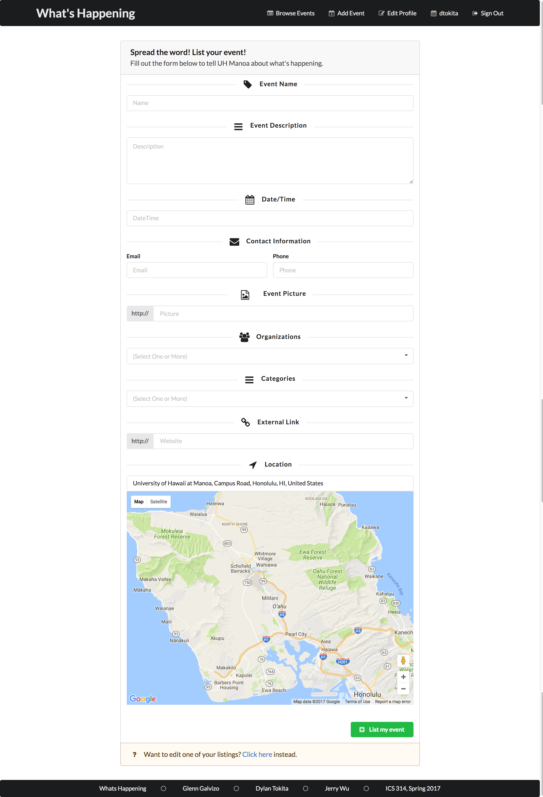
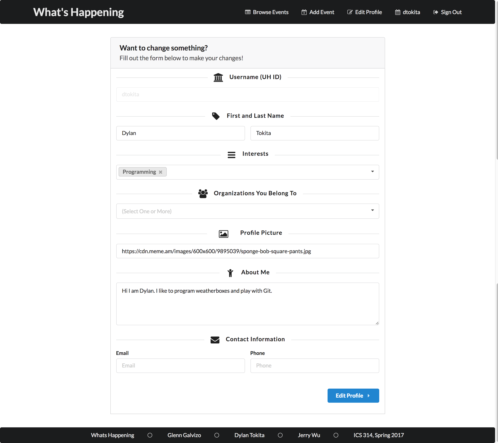

## What is _What's Happening_?

There isn’t a consolidated place where all events on campus can be posted and viewed easily. Event postings are scattered across different media. As a result, promoters have to work hard to get the word out, and consumers have to work hard to search for these events. The **What's Happening** solution is an application where students can both post and view events that are scheduled or happening on campus. 

This application was a project for my Software Engineering class, where me and two other students were tasked to create a web application that solves a problem specific to the University of Hawaii community. My peers and I chose the problem of spreading the word of events, or simply the problem of *what's happening*. 

## The Application

Upon visiting the site, you are greeted with the landing page below.

New users click the *Sign Up & know What's Happening* button to direct them to the account creation page. 

If you have an account, you can just skip this step and click the *Login* item in the menu bar.

Upon signing up or logging in, you are directed to the home page. If you are not logged in, the same events will be displayed but you will not have the option to list events, save events, or edit your profile in the header bar.

Note that you can also get to this page by clicking *Find Out What's Happening* in the landing page, *Browse Events* in the header bar, or *What's Happening* in the header bar.

You can click on event to view more information. From here, you can click the upper right star to save an event, inform the organizer you are attending, or edit the event if you listed it.

To view all public information associated with you, click your UH username in the header bar. You can view all the events you listed, plan-to-attend, or saved by clicking the appropriate tabs.

To list an event of your own, click `Add Event` in the header.

If you need to edit your profile, click *Edit Profile* in the header.

## Development Process 

Our solution is implemented using a web framework known as Meteor, with the [meteor application template](https://ics-software-engineering.github.io/meteor-application-template) serving as our base. Semantic UI was used as our CSS framework, and we used GitHub issues to manage our development.

We had three milestones:

1. Mock-up Development
2. Authentication, Collection, and Google Maps Integration
3. Functional Profile and Event Pages

Of which each milestone had it's own set of issues. Each branch was assigned an issue, and was merged back to the master branch when done. 

More information about the development process can be found [here](https://whats-happening-uhm.github.io/).

## Reflection

The main goal of this project was to exercise everything we learned in the course:

1. Javascript, Underscore
2. HTML, Semantic UI
3. Git, Issue Driven Development 
4. Meteor, Mongo, and Galaxy
5. Keeping a Cool Head 

I think it's safe to say that I am confident in all of these topics as of late. Might be a little iffy on #5 though.

In my honest opinion, this was a fairly stressful project. You never know what you have until you lose it, and group work removes a lot of the freedom independent work has. The biggest constraint I had to deal with in my team were our working hours. I preferred to work three hours earlier than they would, and this often resulted in miscommunication. Things like coding practices and work pace are primarily out of a peer's hands, as they have their own tasks to work on. This would in turn, lead to stress about another person's tasks.

That's not to say I didn't enjoy the project though. I really enjoyed producing this amazing application that I can tell my friends and future employers about. I witnessed first-hand just how powerful GitHub issues are. I've gained a deeper understanding of everything I learned in this course. This is definitely an experience I wouldn't trade for any other.  

Our team GitHub page can be found [here](https://whats-happening-uhm.github.io/). The repository for the project can be found [here](https://github.com/whats-happening-uhm/whats-happening-uhm).